# 🖨️ Raman Prints

**Smart Online Printing Platform for Students**
*Upload documents, calculate print costs instantly, pay online, and track your order in real time.*


[Overview](#-overview) • [Screenshots](#-screenshots) • [Features](#-features) • [Tech Stack](#-tech-stack) • [Project Structure](#-project-structure) • [Quick Start](#-quick-start) • [API Reference](#-api-reference) • [Deployment](#-deployment)

---

## 📌 Overview

**Raman Prints** is a full-stack web application that turns document printing into a self-serve, trackable online service for students. Instead of walking to a print shop and waiting in line, a student can sign up, upload their files, get an instant price quote, pay online (or choose cash on delivery), and follow their order through every stage until it's ready for pickup.

On the other side, admins get a dashboard to manage orders, verify users, configure pricing, and respond to feedback — all from one place.

**Live Demo:** [raman-printer.vercel.app](https://raman-printer.vercel.app)

---

## 📸 Screenshots

### Landing & Auth

| Landing Page | Login |
|---|---|
| 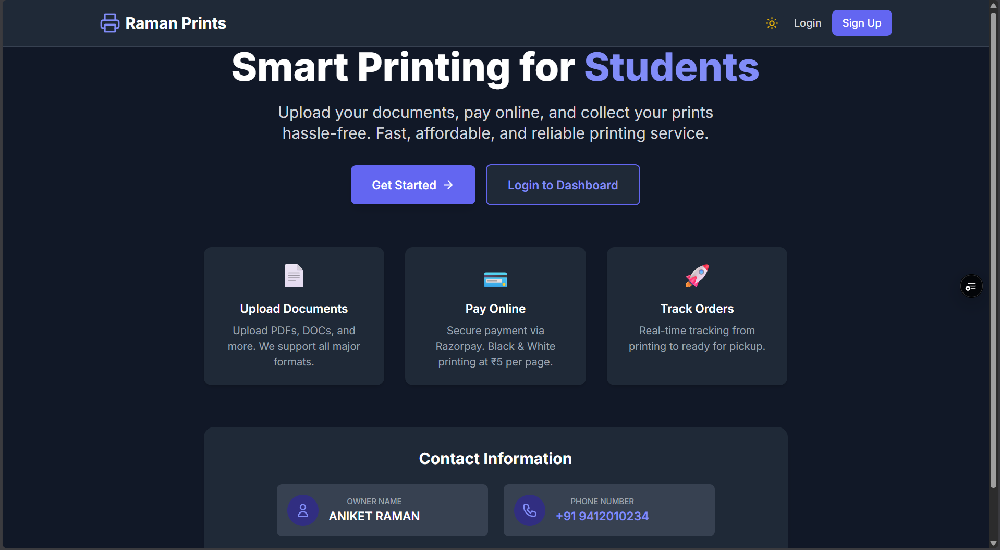 | 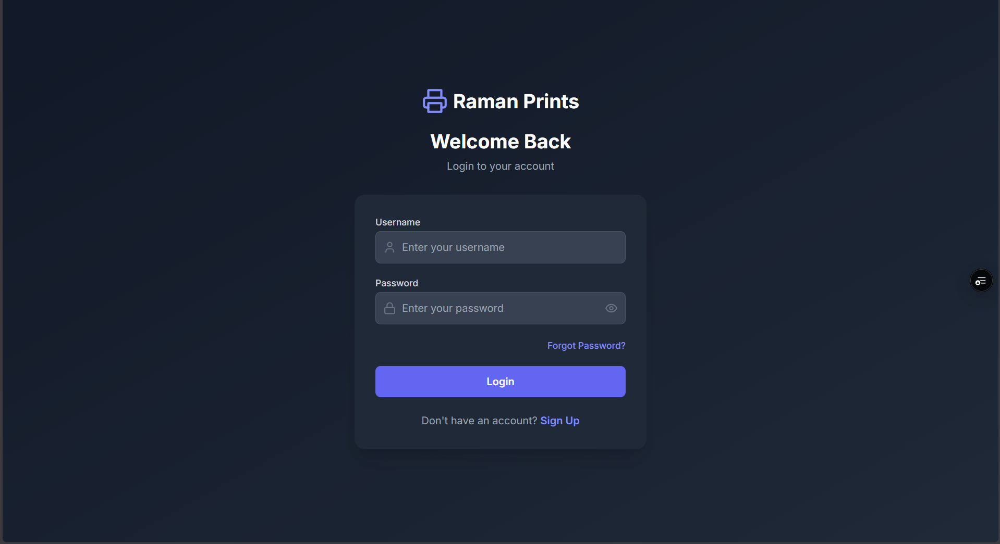 |

### Student Experience

| Dashboard | New Print — Upload |
|---|---|
| 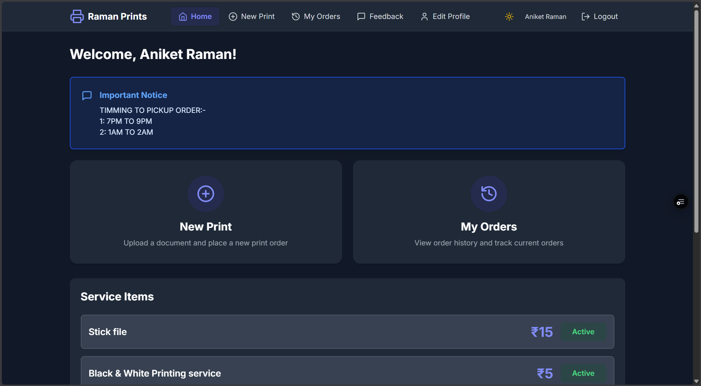 | 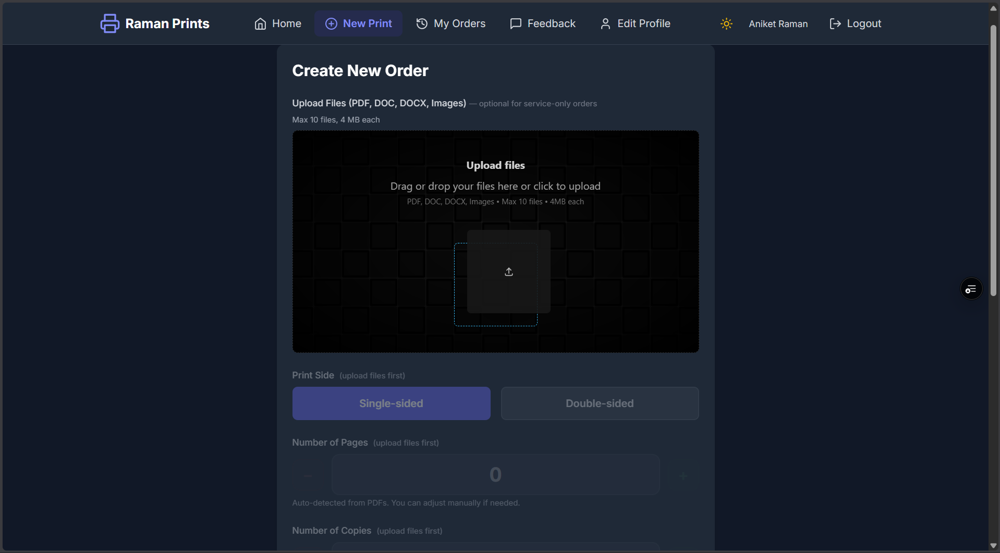 |

| New Print — Checkout | My Orders |
|---|---|
| 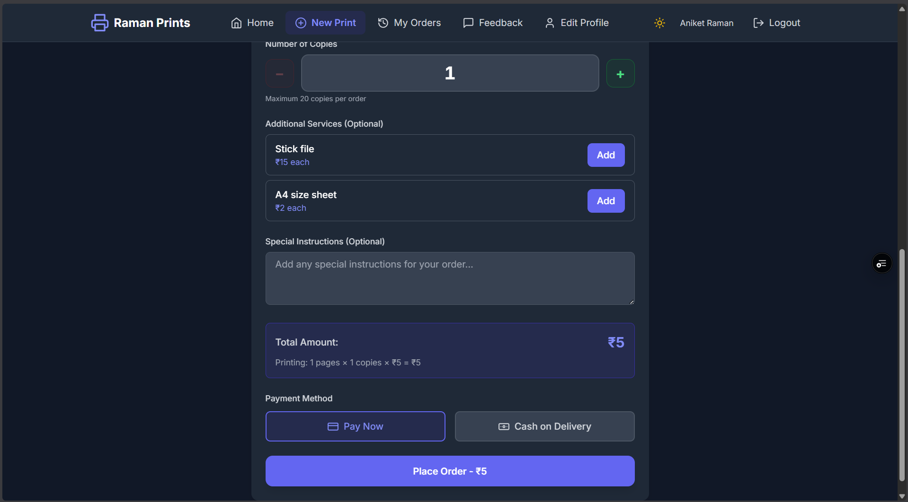 | 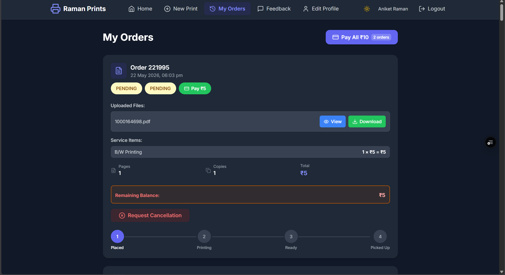 |

| Feedback |
|---|
| 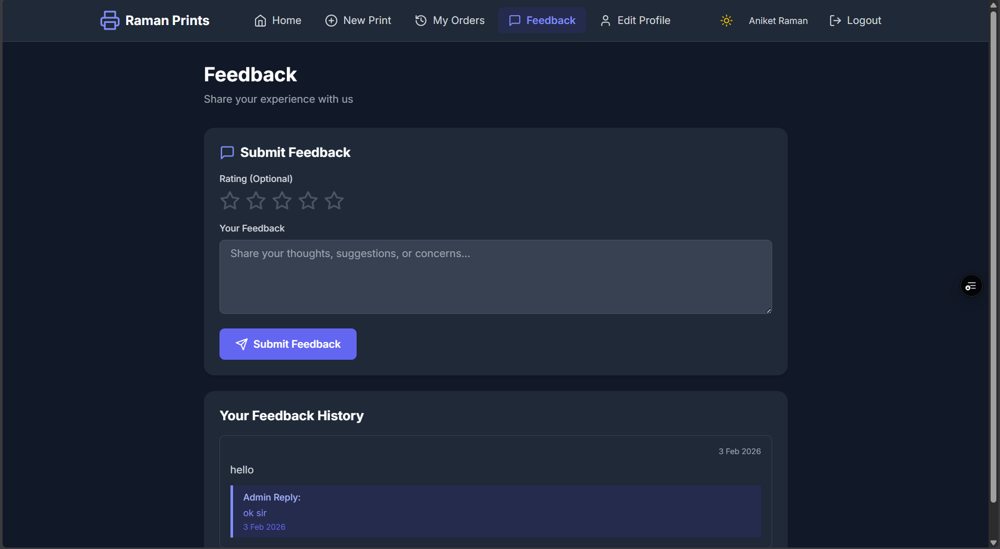 |

### Admin Panel

| Dashboard | Order Management |
|---|---|
| 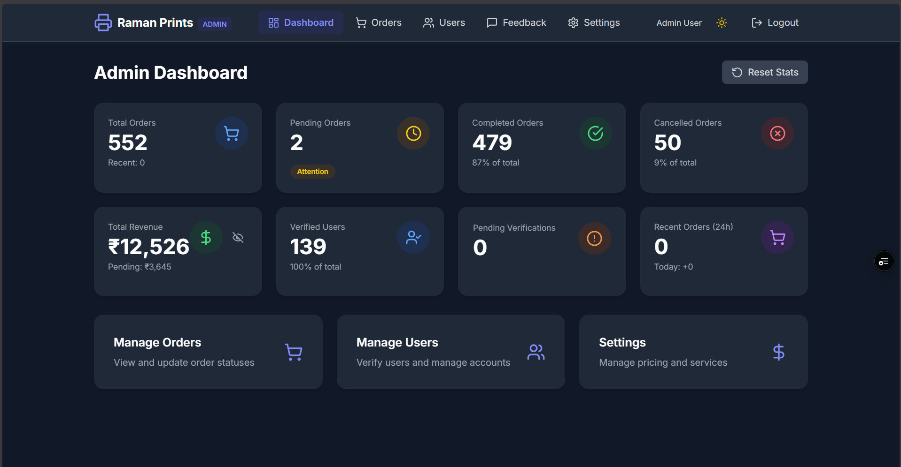 | 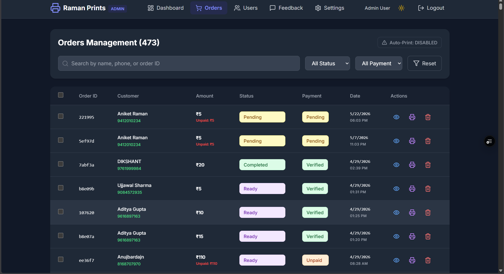 |

| Order Detail | User Management |
|---|---|
| 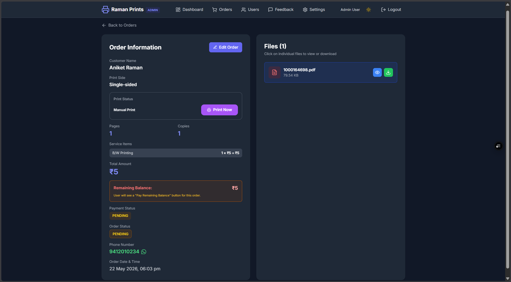 | 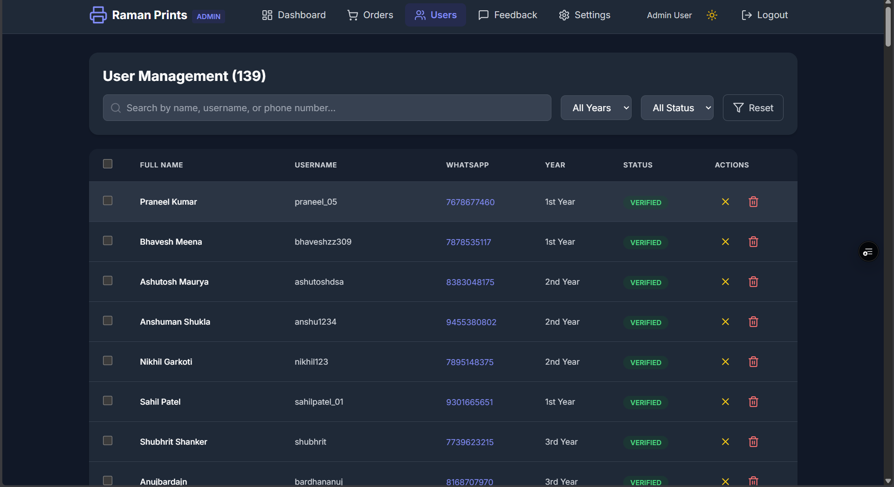 |

| Store & Payment Settings | Auto-Print & Pricing Settings |
|---|---|
| 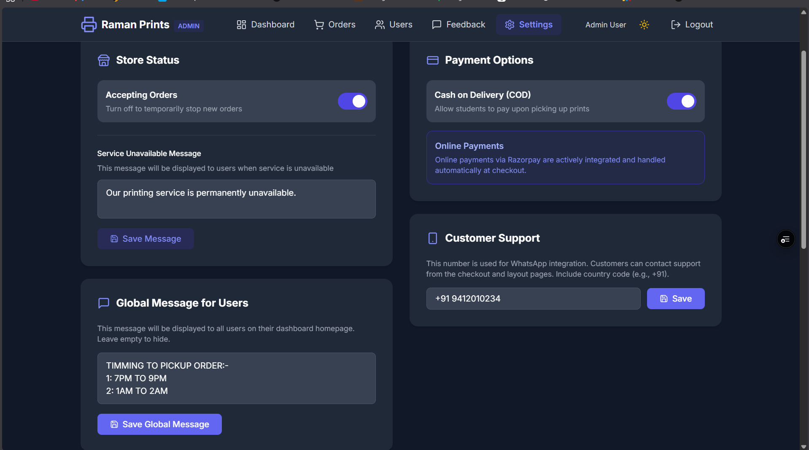 | 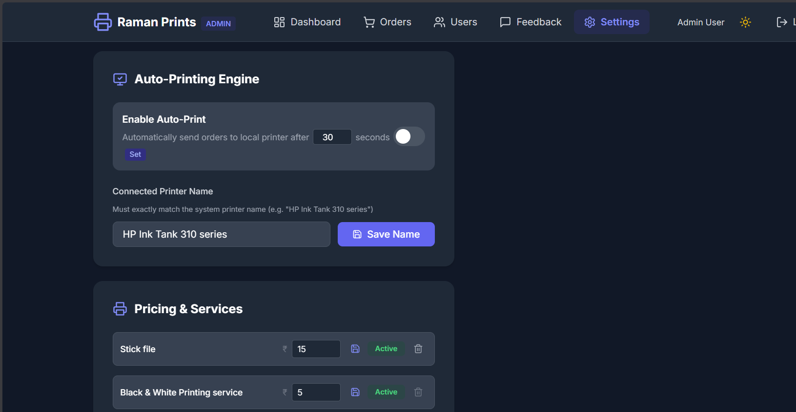 |

|  Feedback Management |
|---|
| 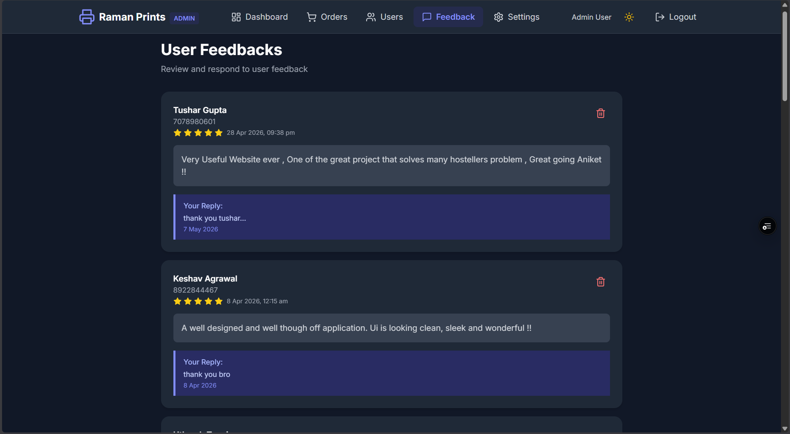 |

---

## ✨ Features

### 🎓 Student Features

| Feature | Description |
|---|---|
| **Authentication** | Signup, login, and forgot-password flow verified via WhatsApp number |
| **Account Verification** | Admin-verified accounts with auto-refreshing status — no need to re-login once verified |
| **File Upload** | Upload PDF, DOC, DOCX, and image files — up to 10 files per order, 4MB each |
| **Auto Page Detection** | PDF page count is detected automatically; double-sided printing adjusts the count |
| **Editable Inputs** | Adjust pages (up to 199) and copies (up to 20) by typing or using +/- controls |
| **Service-Only Orders** | Order add-on services (binding, lamination, etc.) without uploading a file |
| **Live Price Calculator** | Real-time total: `(Pages × ₹2 × Copies) + Services` |
| **Payments** | Pay online via Razorpay, or choose Cash on Delivery |
| **Pay All** | Settle the remaining balance across every unpaid order in one click |
| **Order Tracking** | Visual progress bar: Pending → Printing → Ready → Completed |
| **Cancellations** | Request an order cancellation, subject to admin approval |
| **Feedback** | Rate the service (1–5 stars) and receive admin replies |
| **Dark Mode** | System-wide light/dark theme toggle |

### 🛠️ Admin Features

| Feature | Description |
|---|---|
| **Analytics Dashboard** | Total orders, 24h orders, today's orders, revenue, and status breakdowns |
| **Order Management** | Update status/payment, search, filter, view details, delete with file cleanup |
| **User Management** | Verify accounts (auto WhatsApp notification), soft delete/restore, filter by year |
| **Feedback Management** | View, reply to, and delete student feedback |
| **Settings** | Toggle Cash on Delivery, manage service items & pricing, set price per page |
| **Stats Reset** | Recalculate all dashboard stats from the permanent `OrderLog` history |

---

## 🛠 Tech Stack

| Layer | Technology |
|---|---|
| **Framework** | Next.js 14 (App Router, Server Actions) |
| **Language** | TypeScript |
| **Styling** | Tailwind CSS 3 (responsive, dark mode) |
| **UI/Animation** | Motion (Framer Motion), Lucide React, Tabler Icons |
| **Database** | MongoDB with Mongoose ODM |
| **Authentication** | NextAuth.js v5 (JWT, 30-day sessions) |
| **Payments** | Razorpay |
| **File Handling** | react-dropzone, pdf-parse, pdf-lib, adm-zip, Vercel Blob storage |
| **Validation** | Zod |
| **Password Hashing** | bcryptjs (cost factor 12) |
| **Deployment** | Vercel |

---

## 🧭 Order Workflow

```
   Pending  ──────▶  Printing  ──────▶  Ready  ──────▶  Completed
      │
      └──▶ Cancellation Requested ──▶ Admin Review ──▶ Approved / Denied
```

Every order starts as **Pending**, moves through **Printing** and **Ready**, and finishes at **Completed**. A student can request cancellation at any point before completion, which routes to the admin for approval.

---

## 📂 Project Structure

```
raman-printer/
└── raman_printer/
    └── printer/                      # Next.js application root
        ├── app/
        │   ├── api/                  # API route handlers
        │   │   ├── admin/            # Admin-only endpoints
        │   │   ├── auth/             # NextAuth + forgot password
        │   │   ├── order/            # Order creation, payment, cancellation
        │   │   ├── feedback/
        │   │   ├── page-count/       # PDF page detection
        │   │   ├── razorpay/         # Payment gateway integration
        │   │   ├── settings/
        │   │   └── upload/           # File upload handling
        │   ├── admin/                # Admin dashboard pages
        │   ├── dashboard/            # Student dashboard pages
        │   ├── login/ signup/ forgot-password/
        │   └── layout.tsx, page.tsx
        ├── actions/                  # Server Actions (order, settings, user)
        ├── components/               # Shared UI components
        │   └── ui/
        ├── lib/                      # constants, db connection, utils, razorpay, file conversion
        ├── models/                   # Mongoose schemas (User, Order, OrderLog, Settings, Feedback)
        ├── types/                    # TypeScript type declarations
        ├── public/                   # Static assets
        ├── middleware.ts             # Route protection (/dashboard, /admin)
        ├── auth.ts                   # NextAuth configuration
        └── package.json
```

> Note: the Next.js app lives in `raman_printer/printer`, not the repository root — keep this in mind when cloning and installing.

---

## 🗄️ Database Models

| Model | Key Fields |
|---|---|
| **User** | `fullName`, `whatsappNumber`, `year`, `username`, `password` (bcrypt), `role`, `isVerified`, `isDeleted` |
| **Order** | `userId`, `files[]`, `serviceItems[]`, `pages`, `copies`, `printSide`, `totalAmount`, `paidAmount`, `paymentMethod`, `status`, `paymentStatus`, Razorpay fields, `cancelRequested`, `message` |
| **OrderLog** | `orderId`, `totalAmount`, `createdAt` — a permanent record that survives order deletion |
| **Settings** | `isCodEnabled`, `serviceItems[]`, `pricePerPage`, `isServiceAvailable`, running counters (orders, revenue) |
| **Feedback** | `userId`, `message`, `rating` (1–5), `adminReply`, `adminRepliedAt` |

---

## 🚀 Quick Start

### Prerequisites

- **Node.js** 18 or higher
- **MongoDB** 6+ (local instance or MongoDB Atlas)
- A **Razorpay** account with API keys

### Installation

```bash
# Clone the repository
git clone https://github.com/aniketraman011/raman-printer.git

# The Next.js app lives inside raman_printer/printer
cd raman-printer/raman_printer/printer

# Install dependencies
npm install
```

### Environment Configuration

Create a `.env.local` file in `raman_printer/printer` (see `.env.example`):

```env
# MongoDB connection string (local or Atlas)
MONGODB_URI=mongodb://localhost:27017/ramanprints

# NextAuth
NEXTAUTH_URL=http://localhost:3000
NEXTAUTH_SECRET=your-super-secret-key-change-in-production

# Razorpay (NEXT_PUBLIC_ key is exposed to the browser, keep the secret private)
NEXT_PUBLIC_RAZORPAY_KEY_ID=rzp_test_xxxxxxxxxxxxx
RAZORPAY_KEY_SECRET=your_razorpay_secret_key

# Vercel Blob storage — required for file uploads in production on Vercel
BLOB_READ_WRITE_TOKEN=vercel_blob_rw_xxxxxxxxxxxxx
```

### Run the Development Server

```bash
npm run dev
```

Open [http://localhost:3000](http://localhost:3000) in your browser.

### Other Scripts

```bash
npm run build   # Production build
npm run start   # Start production server
npm run lint    # Run ESLint
```

---

## 📡 API Reference

All routes are under `/api` and implemented as Next.js Route Handlers.

### Auth

| Method | Endpoint | Description |
|---|---|---|
| `GET/POST` | `/api/auth/[...nextauth]` | NextAuth.js sign-in, sign-out, and session handlers |
| `POST` | `/api/auth/forgot-password` | Reset password via WhatsApp number verification |

### Orders

| Method | Endpoint | Description |
|---|---|---|
| `POST` | `/api/order` | Create a new print order |
| `POST` | `/api/order/pay` | Pay for a single order via Razorpay |
| `POST` | `/api/order/pay-all` | Initiate payment for all unpaid orders at once |
| `POST` | `/api/order/pay-all/verify` | Verify the bulk payment signature |
| `POST` | `/api/order/cancel-request` | Request cancellation of an order |
| `POST` | `/api/order/undo-cancel-request` | Withdraw a pending cancellation request |

### Files & Pricing

| Method | Endpoint | Description |
|---|---|---|
| `POST` | `/api/upload` | Upload print files (PDF/DOC/DOCX/images) |
| `POST` | `/api/page-count` | Auto-detect page count from an uploaded PDF |
| `POST` | `/api/razorpay` | Create and verify Razorpay payment orders |

### Feedback & Profile

| Method | Endpoint | Description |
|---|---|---|
| `GET/POST` | `/api/feedback` | List or submit feedback |
| `GET/PUT` | `/api/user/profile` | Fetch or update the logged-in user's profile |
| `GET` | `/api/settings` | Fetch public app settings (pricing, COD, service items) |

### Admin

| Method | Endpoint | Description |
|---|---|---|
| `GET` | `/api/admin/stats` | Fetch dashboard analytics |
| `POST` | `/api/admin/stats/reset` | Recalculate stats from `OrderLog` |
| `GET` | `/api/admin/order/[id]` | Get full order details |
| `PUT` | `/api/admin/order/[id]/edit` | Edit an order |
| `GET` | `/api/admin/feedback` | List all feedback |
| `POST/DELETE` | `/api/admin/feedback/[id]` | Reply to or delete a feedback entry |
| `GET` | `/api/admin/auto-print` | Trigger the auto-print check |
| `POST` | `/api/admin/print-now` | Trigger an immediate print job |

---

## 🔐 Security

- Passwords hashed with **bcryptjs** (12 rounds)
- JWT-based sessions with 30-day expiry via **NextAuth.js v5**
- Role-based access control (`USER` / `ADMIN`)
- Middleware-protected `/dashboard/*` and `/admin/*` routes
- Razorpay HMAC signature verification on payments
- File upload validation (type, size, count)
- Input validation with **Zod** and server-side sanitization
- Soft delete for users to preserve data integrity
- Verification status auto-refreshes every 30 seconds without requiring re-login

---

## ☁️ Deployment

Recommended stack: **Vercel** + **MongoDB Atlas**

1. Push your changes to GitHub
2. Import the project in Vercel (set the root directory to `raman_printer/printer`)
3. Add the environment variables listed above, using your MongoDB Atlas connection string and Razorpay live keys
4. Deploy

For file uploads to work in production on Vercel, make sure **Vercel Blob** storage is enabled and `BLOB_READ_WRITE_TOKEN` is set.

---

## 📈 Future Improvements

- Email notifications alongside WhatsApp
- QR-code based pickup verification
- Print preview before checkout
- Multi-branch / multi-location support
- Coupon and discount system
- Native mobile application

---

## 🤝 Contributing

Contributions are welcome!

```bash
# Fork the repository, then create a feature branch
git checkout -b feature/amazing-feature

# Commit your changes
git commit -m "Add amazing feature"

# Push and open a pull request
git push origin feature/amazing-feature
```

---

## 📄 License

No `LICENSE` file is currently included in this repository. Add one (MIT, Apache-2.0, etc.) if you intend for others to reuse this code.

---

## 👨‍💻 Author

**Aniket Raman**
B.Tech Computer Science Engineering, Indian Institute of Information Technology (IIIT) Sonepat

- GitHub: [@aniketraman011](https://github.com/aniketraman011)

---

<div align="center">

**⭐ If you find this project useful, consider starring the repository!**

</div>
